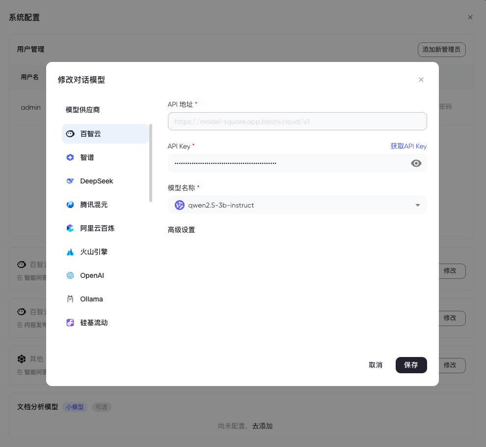
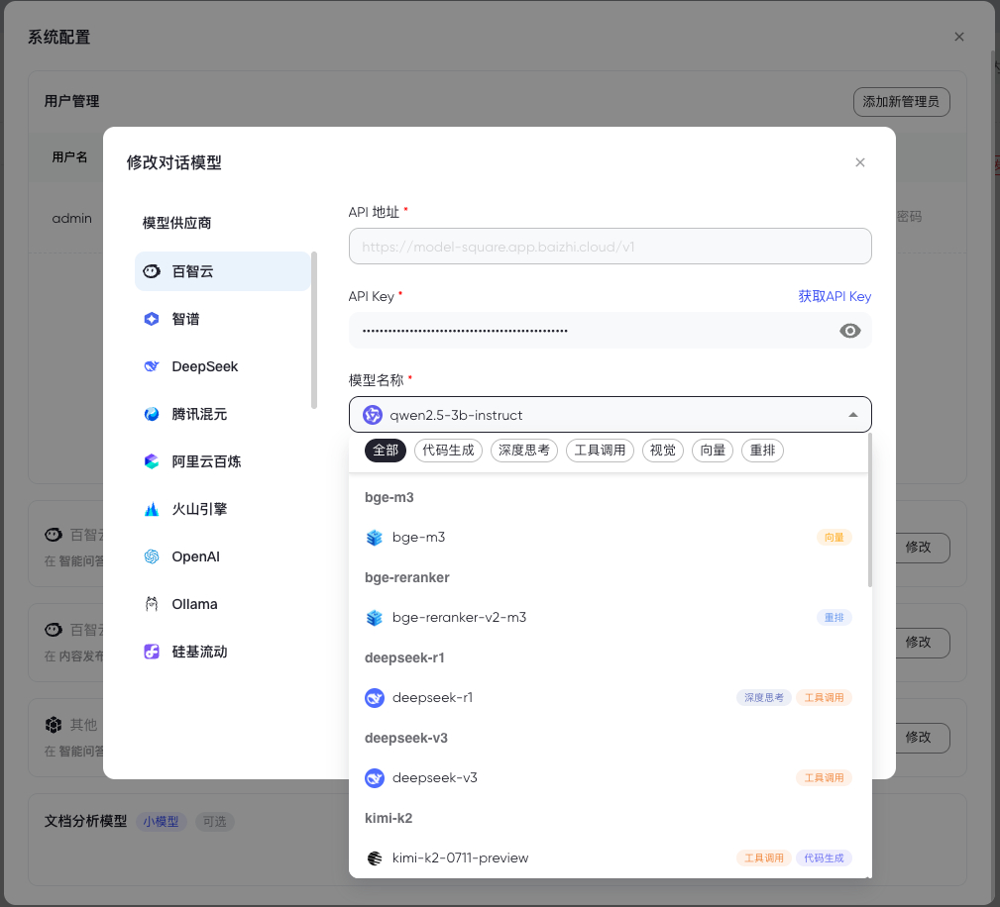

# ModelKit

[](https://golang.org)
[](https://reactjs.org)
[](LICENSE)

ModelKit 是一个强大的AI模型管理平台，支持多种AI服务提供商，提供统一的模型管理、配置验证服务。

## 🚀 功能特性

- **多模型提供商支持**: 支持 OpenAI、Ollama、DeepSeek、SiliconFlow、Moonshot、Azure OpenAI、百智云、腾讯混元、百炼、火山引擎、Gemini、智谱等主流AI服务商
- **模型类型管理**: 支持聊天模型、嵌入模型、重排序模型、视觉模型、代码模型、函数调用等多种模型类型
- **配置验证**: 提供模型配置的实时验证功能，确保API配置正确性
- **现代化Web界面**: 基于React 19和Material-UI构建的响应式用户界面
- **国际化支持**: 内置中英文多语言支持
- **可复用组件**: 提供开箱即用的ModelModal组件，支持在其他项目中快速集成

## ⚡️ 界面展示

| 添加模型                                 | 模型列表                                    |  
| ------------------------------------------------ | ------------------------------------------------ |
|  |  |

## 快速开始
1. 加载modelkit前后端依赖 
2. 后端实现ListModel,CreateModel,UpdateModel,CheckModel 4个接口， 其中ListModel, CheckModel已提供业务逻辑，在handler中调用即可
3. 用这4个接口实现前端前端ModelService接口，传入modelkit-ui组件即可使用

## Usage

### 1. 安装依赖

#### 后端依赖
```bash
go get github.com/chaitin/ModelKit/v2
go get github.com/labstack/echo/v4
go get github.com/go-playground/validator/v10
```

#### 前端依赖
```bash
npm install @ctzhian/modelkit
# 或
yarn add @ctzhian/modelkit
```

### 2. 实现接口

需要实现以下4个接口，其中 `listModel` 和 `checkModel` 已提供业务逻辑，在handler中调用即可：
+ `listModel`：获取模型列表
+ `checkModel`：检查模型配置
+ `createModel`：创建模型
+ `updateModel`：更新模型

### 3. 后端使用方式

在handler中调用 `listModel` 与 `checkModel` 业务逻辑：

```go
package v1

import (
    "net/http"
    "github.com/chaitin/ModelKit/v2/domain"
    modelkit "github.com/chaitin/ModelKit/v2/usecase"
    "github.com/labstack/echo/v4"
)

modelkit := modelkit.NewModelKit(logger.Logger)

// GetModelList 获取模型列表
func (m *ModelKit) GetModelList(c echo.Context) error {
    var req domain.ModelListReq
    if err := c.Bind(&req); err != nil {
        return c.JSON(http.StatusBadRequest, domain.Response{
            Success: false,
            Message: "参数绑定失败: " + err.Error(),
        })
    }

    // 调用ModelKit提供的业务逻辑
    resp, err := modelkit.ModelList(c.Request().Context(), &req)
    if err != nil {
        return c.JSON(http.StatusInternalServerError, domain.Response{
            Success: false,
            Message: err.Error(),
        })
    }

    return c.JSON(http.StatusOK, domain.Response{
        Success: true,
        Message: "获取模型列表成功",
        Data:    resp,
    })
}

// CheckModel 检查模型
func (m *ModelKit) CheckModel(c echo.Context) error {
    var req domain.CheckModelReq
    if err := c.Bind(&req); err != nil {
        return c.JSON(http.StatusBadRequest, domain.Response{
            Success: false,
            Message: "参数绑定失败: " + err.Error(),
        })
    }

    // 调用ModelKit提供的业务逻辑
    resp, err := modelkit.CheckModel(c.Request().Context(), &req)
    if err != nil {
        return c.JSON(http.StatusInternalServerError, domain.Response{
            Success: false,
            Message: err.Error(),
        })
    }

    if resp.Error != "" {
        return c.JSON(http.StatusBadRequest, domain.Response{
            Success: false,
            Message: "模型检查失败",
            Data:    resp,
        })
    }

    return c.JSON(http.StatusOK, domain.Response{
        Success: true,
        Message: "模型检查成功",
        Data:    resp,
    })
}

// CreateModel 创建模型 (需要自行实现业务逻辑)
func (m *ModelKit) CreateModel(c echo.Context) error {
    // 实现创建模型的业务逻辑
    // ...
}

// UpdateModel 更新模型 (需要自行实现业务逻辑)
func (m *ModelKit) UpdateModel(c echo.Context) error {
    // 实现更新模型的业务逻辑
    // ...
}
```

### 4. 前端使用方式

```typescript
// 1. 引入ModelKit组件和类型
import { 
    ModelModal, 
    Model, 
    ModelService, 
    ConstsModelType as ModelKitType, 
    ModelListItem 
} from '@yokowu/modelkit-ui';

// 2. 创建符合ModelService接口的服务实现
const modelService: ModelService = {
    createModel: async (params) => {
        const response = await postCreateModel(params as unknown as DomainCreateModelReq);
        return { model: response as unknown as Model };
    },
    listModel: async (params) => {
        const response = await getGetProviderModelList(params as unknown as GetGetProviderModelListParams);
        return { models: response?.models || [] };
    },
    checkModel: async (params) => {
        const response = await postCheckModel(params as unknown as DomainCheckModelReq);
        return { model: response as unknown as Model };
    },
    updateModel: async (params) => {
        const response = await putUpdateModel(params as unknown as DomainUpdateModelReq);
        return { model: response as unknown as Model };
    }
};

// 3. 使用ModelModal组件
function App() {
    const [open, setOpen] = useState(false);
    const [editData, setEditData] = useState<Model | null>(null);
    const [modelType, setModelType] = useState<ModelKitType>(ModelKitType.CHAT);

    const refreshModel = () => {
        // 刷新模型列表的逻辑
    };

    return (
        <ModelModal
            open={open}
            onClose={() => {
                setOpen(false);
                setEditData(null);
            }}
            refresh={refreshModel}
            data={editData}
            type={modelType}
            modelService={modelService}
            language="zh-CN"
        />
    );
}
```

### 开发环境设置

1. **后端开发**
   ```bash
   go mod tidy
   ```

2. **前端开发**
   ```bash
   cd ui/ModelModal
   pnpm install
   ```

## 🙏 致谢

感谢所有为ModelKit项目做出贡献的开发者和用户！

---

**ModelKit** - 让AI模型管理更简单 🚀